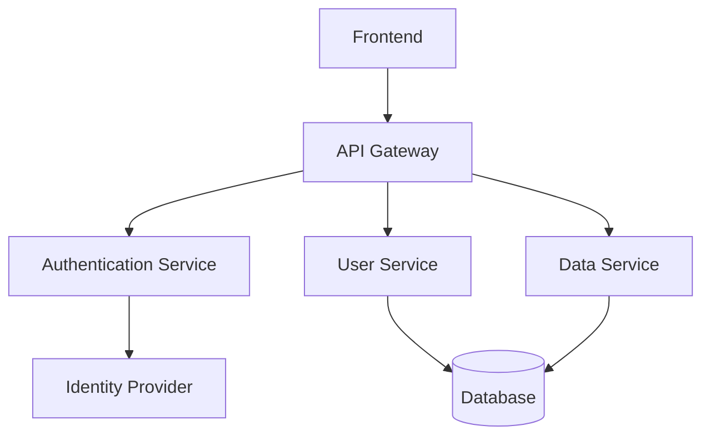
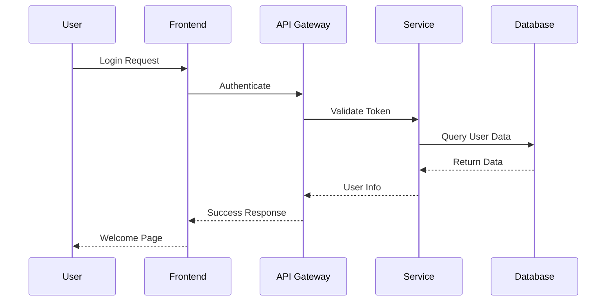

# Architecture Overview

## System Architecture

This document describes the high-level architecture of the system.

### Component Diagram

### Data Flow

## Technology Stack

- **Frontend**: React.js
- **Backend**: Node.js with Express
- **Database**: PostgreSQL
- **Authentication**: OAuth 2.0
- **Deployment**: Docker & Kubernetes

## Key Components

1. **API Gateway**: Handles routing and authentication
2. **User Service**: Manages user data and profiles
3. **Data Service**: Handles business logic and data processing
4. **Database**: PostgreSQL for persistent storage 